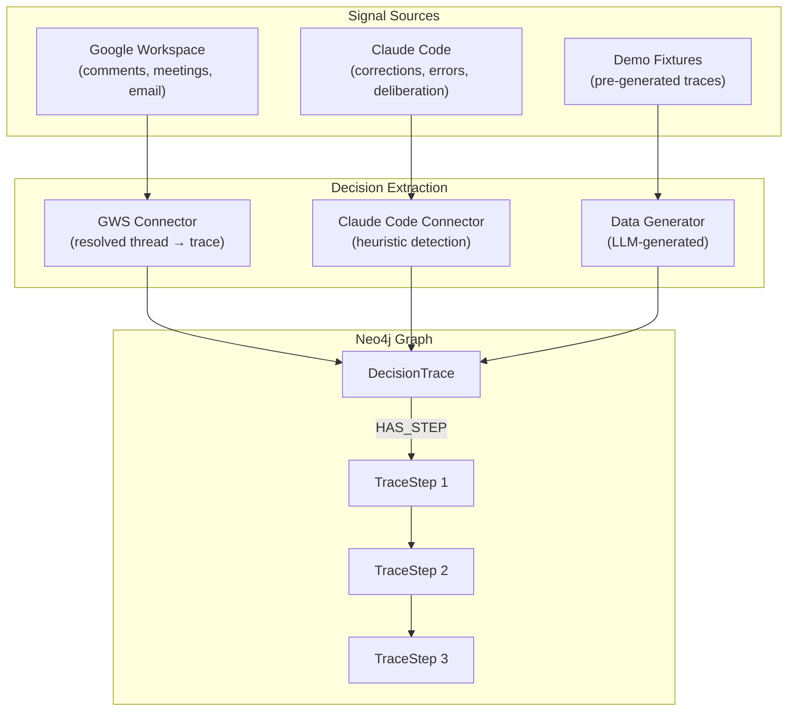

# How Decision Traces Work

Decision traces capture the *why* behind choices -- not just what was decided, but who was involved, what alternatives were considered, and how the decision was reached. Different connectors extract decision traces from different signal sources. This page explains how two key connectors -- Google Workspace and Claude Code -- detect and extract decisions into graph-connected traces.



## Google Workspace

Every organization's most valuable knowledge isn't in its documents -- it's in the spaces *between* documents: the comment thread where someone said "let's go with option B," the meeting where three people aligned on an approach, the email chain where a deadline was negotiated. This section explains how the Google Workspace connector extracts these collaborative signals as graph-connected decision traces.

<!-- TODO: Export from decision-trace-structure.excalidraw and replace placeholder -->


## The Problem: The Missing "Why"

When an agent encounters a question like "Why did we choose Postgres over DynamoDB?" or "Who approved the Q3 budget increase?", the answer rarely lives in a single document. It lives in:

- A **comment thread** on a Google Doc where the team debated the options
- A **meeting invite** where the decision was discussed
- An **email thread** where stakeholders were consulted
- A **revision** where someone changed the recommendation

Traditional RAG systems can find the document, but they miss the decision provenance. They can tell you *what* was decided, but not *why*, *by whom*, or *when*.

## Five Decision Signals in Google Workspace

Google Workspace contains five distinct types of decision signal that no other data source provides:

### 1. Comment threads with resolution

When a comment thread is resolved in Google Docs, it represents a **decision**. The thread captures the question, the participants, the deliberation, and the resolution:

```
Alice: "Should we use SAML or OIDC for SSO?"
  └─ Bob: "OIDC is simpler for our stack"
  └─ Carol: "Agreed, let's go OIDC"
  └─ Alice: ✓ Resolved
```

This is the most explicit decision signal available in any collaborative tool. The `quotedFileContent` provides the document context, the replies provide the deliberation, the resolution provides the outcome, and the authors provide the decision participants.

### 2. Revision history with authorship

The Drive Revisions API tracks who modified a document and when, creating a temporal chain of document evolution. This shows how a document went from draft to final, and who contributed at each stage.

### 3. Drive Activity with provenance

The Drive Activity API records every action (create, edit, move, share, comment, rename) with actor, target, and timestamp. This is a complete audit trail: who did what, when, to which file.

### 4. Calendar events with attendees

Meeting events provide the human context for decisions: who was in the room, what was on the agenda, and when it happened. When a meeting description links to a Google Doc, the connector creates a `DISCUSSED_IN` relationship.

### 5. Email threads with participants

Gmail thread metadata (subject, participants, dates) captures asynchronous decision channels. When an email thread references a Drive file URL, it's linked to the document via `THREAD_ABOUT`.

## How Comment Threads Become Decision Traces

The connector transforms each comment thread into graph nodes using this logic:

### Step 1: Fetch and classify

For each Google Docs/Sheets/Slides file, the connector fetches all comments via the Drive Comments API. Each comment is classified:

- **Resolved thread** (the primary target): The `resolved: true` flag indicates a decision was made. These become `DecisionThread` nodes with full metadata.
- **Open thread**: An unresolved comment becomes a `DecisionThread` with `resolved: false` -- surfaced by the `open_questions` agent tool as pending decisions.

### Step 2: Extract the decision structure

For resolved threads, the connector creates:

```
(:Document)-[:HAS_COMMENT_THREAD]->(:DecisionThread)
(:DecisionThread)-[:AUTHORED_BY]->(:Person)    # who asked
(:DecisionThread)-[:RESOLVED_BY]->(:Person)    # who decided
(:DecisionThread)-[:HAS_REPLY]->(:Reply)       # each response
(:Reply)-[:AUTHORED_BY]->(:Person)             # who replied
```

Key properties on the DecisionThread node:
- `content`: The original question or proposal
- `quotedContent`: The document text the comment was anchored to
- `resolution`: The final reply content (the "answer")
- `resolved`: Boolean flag
- `participantCount`: Number of unique participants

### Step 3: Generate reasoning traces

Each resolved thread also generates a **decision trace** in the same format used by neo4j-agent-memory for reasoning memory:

```json
{
  "id": "trace-gdrive-comment-123",
  "task": "Decision on 'Caching Strategy PRD': Should we use Redis or Memcached?",
  "outcome": "Resolved: Redis is better for our use case",
  "steps": [
    {
      "thought": "Question raised on 'Caching Strategy PRD': Should we use Redis or Memcached?",
      "action": "Alice started discussion",
      "observation": "Posted at 2026-03-05T10:30:00Z"
    },
    {
      "thought": "Redis is better for our use case — supports data structures",
      "action": "Bob replied",
      "observation": "Replied at 2026-03-05T11:00:00Z"
    },
    {
      "thought": "Agreed, let's go with Redis",
      "action": "Carol replied",
      "observation": "Replied at 2026-03-05T12:00:00Z"
    },
    {
      "thought": "Thread resolved — decision made",
      "action": "Alice resolved the discussion",
      "observation": "Resolved at 2026-03-06T14:22:00Z"
    }
  ]
}
```

This connects the agent's reasoning memory to the organization's decision memory.

## Cross-Connector Linking

When the Google Workspace connector runs alongside the Linear connector, it automatically detects cross-references:

- **Linear issue references** (e.g., `ENG-123`, `PROJECT-456`) in comment bodies, document names, email subjects, and meeting descriptions are linked via `RELATES_TO_ISSUE` relationships.
- **Drive file URLs** in Linear issue descriptions or calendar events create document-to-context links.

This creates a complete decision lifecycle in the graph:

```
Meeting: "Platform team sync" (Calendar)
  │
  ├─[DISCUSSED_IN]─> Doc: "Caching Strategy PRD" (Drive)
  │                        │
  │                        ├─[HAS_COMMENT_THREAD]─> Decision: "Use Redis" (Comments)
  │                        │                             │
  │                        │                             └─[RELATES_TO_ISSUE]─> ENG-456 (Linear)
  │                        │
  │                        └─[HAS_REVISION]─> Rev: Alice edited Mar 15 (Revisions)
  │
  └─[ATTENDEE_OF]─> Person: Alice, Bob, Carol (Calendar+Drive)
```

No other agent memory system provides this cross-source decision provenance.

## Why Graph Beats RAG for Decisions

A vector-based RAG system can find the document that mentions "Redis" and return the relevant paragraph. But it cannot:

- **Trace the decision chain**: Which comment thread established the decision? Who was involved? Was there disagreement?
- **Connect meetings to decisions**: Which meeting preceded the decision? Who attended?
- **Find open questions**: What discussions are still unresolved across all documents?
- **Identify decision makers**: Who resolves the most threads? Who participates in the most decisions?
- **Cross-reference execution**: Is the Linear issue `ENG-456` actually implementing what was decided in the comment thread?

These are all **multi-hop graph traversals** that require structured relationships between nodes -- exactly what a context graph provides.

## Claude Code

When you work with Claude Code, decisions happen constantly -- you redirect the agent's approach, it deliberates between alternatives, errors lead to fixes, and dependency choices accumulate. The Claude Code connector detects these decision signals from your local session history and extracts them as graph-connected traces.

Unlike Google Workspace decisions (which are collaborative and explicitly resolved), Claude Code decisions are **conversational and heuristic** -- the connector uses pattern matching and contextual analysis to identify decision points, assigning each a confidence score (0.0--1.0).

### Four Decision Signals in Claude Code

#### 1. User corrections

When you redirect Claude's approach, the connector detects a decision. The original approach becomes a rejected alternative and your correction becomes the chosen one:

```
You: "Set up JWT authentication for the API"
Claude: [implements JWT with refresh tokens]
You: "No, use OAuth2 with PKCE instead"
Claude: [switches to OAuth2 implementation]
```

This creates:
```
(:Session)-[:MADE_DECISION]->(:Decision {description: "Switch to OAuth2 with PKCE", category: "correction"})
(:Decision)-[:CHOSE]->(:Alternative {description: "OAuth2 with PKCE"})
(:Decision)-[:REJECTED]->(:Alternative {description: "JWT with refresh tokens"})
```

Confidence: **High (0.8-0.95)** -- explicit user redirection is a strong decision signal.

#### 2. Deliberation markers

When Claude discusses trade-offs between approaches, the connector captures the alternatives and reasoning:

```
Claude: "We could use FastAPI or Flask here. FastAPI gives us async support
and automatic OpenAPI docs, while Flask is simpler and has more tutorials.
Given your project already uses async, FastAPI is the better fit."
```

This creates a Decision node with two Alternatives, one marked as chosen based on the conclusion.

Confidence: **Medium (0.5-0.75)** -- deliberation is detected heuristically from phrases like "we could," "the trade-off is," "alternatively."

#### 3. Error-resolution cycles

When a tool call fails and Claude fixes the problem, the error and resolution are linked as a decision:

```
Claude: [runs pytest → fails with ImportError]
Claude: [edits requirements.txt to add missing package]
Claude: [runs pytest → passes]
```

This creates:
```
(:ToolCall {isError: true})-[:ENCOUNTERED_ERROR]->(:Error)
(:Decision {category: "error-fix"})-[:RESULTED_IN]->(:ToolCall)  # the fix
```

Confidence: **High (0.7-0.9)** -- the error-fix pattern is structurally clear.

#### 4. Dependency changes

Package install commands (`pip install`, `npm install`, `cargo add`, etc.) are captured as dependency decisions. When the same package appears across multiple sessions, it may also generate a Preference node.

Confidence: **Medium (0.5-0.7)** -- dependency installs are captured but may be routine rather than deliberate choices.

### Comparison: Google Workspace vs. Claude Code

| Aspect | Google Workspace | Claude Code |
|--------|-----------------|-------------|
| **Signal source** | Comment threads, revisions, meetings, email | User corrections, deliberation, errors, installs |
| **Participants** | Multiple people (collaborative) | User + Claude (conversational) |
| **Confidence model** | High (explicit resolution flags) | Heuristic (0.0--1.0 scored) |
| **Resolution signal** | Thread resolved flag | Correction or successful retry |
| **Decision entity** | `DecisionThread` with replies | `Decision` with `Alternative` nodes |
| **Unique strength** | Cross-person provenance | Reasoning chain reconstruction |

### From Decisions to Preferences

A distinctive feature of Claude Code decision extraction is that decisions **accumulate into preferences**. When you make the same choice across multiple sessions (e.g., always choosing pytest over unittest, always preferring single quotes), the connector detects this pattern and creates Preference nodes with increasing confidence scores. This is something Google Workspace cannot provide -- it captures group decisions, while Claude Code captures individual developer patterns over time.

## Further Reading

- [Build a Developer Knowledge Graph from Claude Code Sessions](/docs/tutorials/claude-code-sessions) -- Step-by-step tutorial
- [Claude Code Session Schema](/docs/reference/claude-code-schema) -- Complete entity and relationship reference
- [Decision Traces from Google Workspace](/docs/tutorials/google-workspace-decisions) -- Step-by-step tutorial
- [Import Data from SaaS Services](/docs/how-to/import-saas-data) -- Configuration reference
- [Three Memory Types](/docs/explanation/three-memory-types) -- How decision traces fit into neo4j-agent-memory
- [Why Context Graphs?](/docs/explanation/why-context-graphs) -- Graph vs. vector for agent memory
