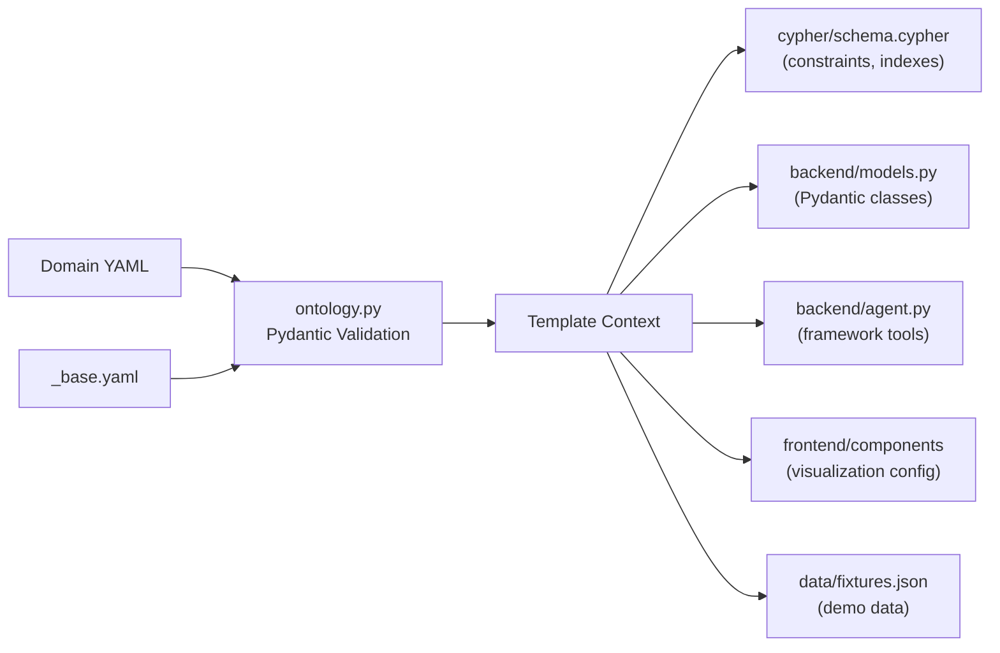

# How Domain Ontologies Work

Domain ontologies are the central design concept in create-context-graph. A single YAML file defines everything about a domain -- its entities, relationships, agent behavior, and visualization -- and the tool uses that definition to generate an entire application. This page explains how that mechanism works and why it was designed this way.

## What Is a Domain Ontology?

In this project, a domain ontology is a structured YAML file that describes:

- **What exists** in a domain (entity types and their properties)
- **How things relate** (relationship types between entities)
- **What the agent can do** (tools with Cypher queries)
- **How the agent behaves** (system prompt, demo scenarios)
- **What data looks like** (document templates, decision traces)
- **How it is visualized** (node colors, sizes, default queries)

The ontology is not code. It is a declarative specification that gets fed into Jinja2 templates at generation time. The templates read the ontology and produce working Python, TypeScript, Cypher, and configuration files.

## Two-Layer Inheritance

Every domain ontology is built on top of a shared base. The base ontology (`_base.yaml`) defines the POLE+O entity types that are common across all domains:

| Base Entity | POLE+O Type | Description |
|-------------|-------------|-------------|
| Person | PERSON | Individuals -- customers, employees, patients, suspects |
| Organization | ORGANIZATION | Companies, agencies, teams, departments |
| Location | LOCATION | Physical places with optional coordinates |
| Event | EVENT | Time-bound occurrences |
| Object | OBJECT | Catch-all for domain-specific things |

The base also defines common relationships: `WORKS_FOR` (Person to Organization), `LOCATED_AT` (Organization to Location), and `PARTICIPATED_IN` (Person to Event).

When a domain YAML declares `inherits: _base`, the loader performs a merge:

1. Base entity types are prepended to the domain's entity list.
2. Base relationships are prepended to the domain's relationship list.
3. If the domain defines an entity with the same label as a base entity (e.g., its own `Person` with extra properties), the domain version takes precedence and the base version is skipped.

This means every domain automatically gets Person, Organization, Location, and Event nodes without redeclaring them, while retaining the freedom to override any base type with a domain-specific version.

## Example: A Minimal Ontology Snippet

Here is a simplified excerpt from the healthcare domain YAML to ground the abstract concepts:

```yaml
inherits: _base

domain:
  id: healthcare
  name: Healthcare
  description: Hospital and clinic management
  tagline: "AI-powered healthcare intelligence"
  emoji: "🏥"

entity_types:
  - label: Patient
    pole_type: PERSON
    subtype: patient
    color: "#4CAF50"
    icon: user
    properties:
      - name: name
        type: string
        required: true
        unique: true
      - name: date_of_birth
        type: date
      - name: blood_type
        type: string
        enum: ["A+", "A-", "B+", "B-", "O+", "O-", "AB+", "AB-"]

  - label: Diagnosis
    pole_type: OBJECT
    subtype: medical
    color: "#FF5722"
    icon: activity
    properties:
      - name: name
        type: string
        required: true
      - name: severity
        type: string
        enum: ["mild", "moderate", "severe", "critical"]

relationships:
  - type: DIAGNOSED_WITH
    source: Patient
    target: Diagnosis

agent_tools:
  - name: find_patient
    description: Find a patient by name
    cypher: "MATCH (p:Patient) WHERE p.name CONTAINS $name RETURN p"
    parameters:
      - name: name
        type: string
        description: Patient name to search for
```

This single YAML drives the entire generated application -- schema, models, agent tools, and visualization. See the [Ontology YAML Schema](/docs/reference/ontology-yaml-schema) for the complete specification.

<!-- TODO: Export from ontology-pipeline.excalidraw and replace placeholder -->


## How the Ontology Drives Code Generation



The ontology YAML is loaded into a `DomainOntology` Pydantic model, which is then passed as context to every Jinja2 template. Here is how each section of the ontology influences the generated output:

### Entity Types to Neo4j Schema

Each `entity_types` entry with `unique: true` properties generates a Cypher uniqueness constraint. Every entity type also gets a name index for fast lookups. The result is written to `cypher/schema.cypher`.

### Entity Types to Pydantic Models

Each entity label becomes a Python class in `backend/app/models.py`. Properties map to typed fields. Enum properties generate Python `Enum` classes. Required properties become mandatory fields; optional ones default to `None`.

### Agent Tools to Framework-Specific Code

The `agent_tools` list is iterated in the agent template (`agent.py.j2`) to produce tool definitions in the chosen framework's idiom. For PydanticAI, each tool becomes an `@agent.tool` decorated function. For LangGraph, each becomes a `@tool` function. The Cypher query and parameter definitions come directly from the YAML.

### System Prompt

The `system_prompt` string is injected verbatim into the agent configuration. It tells the LLM what domain it operates in, what tools are available, and how to behave.

### Visualization Config

The `visualization` section (plus the `color` field on each entity type) populates the NVL component's configuration in the frontend. Node colors, sizes, and the initial Cypher query for the graph view all come from the ontology.

### Document Templates and Decision Traces

These sections drive the data generation pipeline. When `--demo-data` is used, the generator reads `document_templates` to know what kinds of documents to produce and `decision_traces` to know what reasoning scenarios to simulate.

### Demo Scenarios

The `demo_scenarios` list becomes clickable preset prompts in the chat interface, giving users a guided tour of the agent's capabilities without having to think of questions.

## Domain-Agnostic Templates, Data-Driven Output

A key design decision: there are no per-domain template directories. The same set of Jinja2 templates produces a healthcare app, a financial services app, a wildlife conservation app, or any of the other 22 built-in domains. The templates are parameterized entirely by the ontology context.

This means:

- Adding a new domain requires only a YAML file, not new templates.
- Improvements to templates (better UI, new features, bug fixes) benefit all domains simultaneously.
- The template surface area stays small and maintainable regardless of how many domains exist.

The only template that varies by a non-ontology dimension is `agent.py.j2`, which has one version per supported agent framework (PydanticAI, Claude Agent SDK, LangGraph, etc.). But even those framework-specific templates read the same ontology context -- they just express tool definitions and agent setup in different framework idioms.

## How 22 Domains Produce 22 Unique Applications

Consider two domains: `healthcare` and `financial-services`. Both inherit from `_base`, so both get Person, Organization, Location, and Event. But:

- Healthcare adds Patient (a specialized Person), Diagnosis, Treatment, Medication, and Appointment entity types with medical properties.
- Financial Services adds Account, Transaction, Portfolio, and Decision entity types with financial properties.

The same `routes.py` template generates API endpoints for both. The same `ChatInterface.tsx` template generates the chat UI for both. But the models, schema, tools, system prompt, visualization, and demo scenarios are completely different because they come from different ontology YAML files.

The result: one codebase for the generator, 22 distinct applications out the other end.

## Extending with Custom Domains

Beyond the 22 built-in domains, users can create custom ontologies in two ways:

1. **Write a YAML file manually.** Follow the schema, place it in the `domains/` directory (or `~/.create-context-graph/custom-domains/`), and it becomes available as a `--domain` option.

2. **Use `--custom-domain` with a natural language description.** The CLI sends the description to an LLM, which generates a complete ontology YAML. This YAML goes through the same validation and template rendering pipeline as any built-in domain.

Both paths produce the same output: a `DomainOntology` object that drives the templates.
