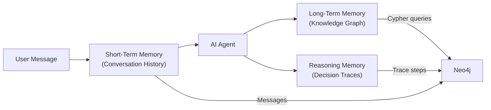

# Why Context Graphs Need All Three Memory Types

AI agents that interact with knowledge graphs need more than a vector store. They need three distinct kinds of memory -- short-term, long-term, and reasoning -- each serving a different purpose and stored in a different way. This page explains what each type is, why it matters, and how create-context-graph implements all three.

## Quick Reference

| Memory Type | Purpose | Stored As | Example | Retention |
|-------------|---------|-----------|---------|-----------|
| **Short-term** | Current conversation context | Message nodes per session | "The patient I asked about earlier" | Session-scoped |
| **Long-term** | Persistent domain knowledge | POLE+O entity graph | People, organizations, events, relationships | Permanent |
| **Reasoning** | Decision audit trail | DecisionTrace → TraceStep chains | "Why was this treatment recommended?" | Permanent |

<!-- TODO: Export from memory-architecture.excalidraw and replace placeholder -->

## The Three Memory Types

### Short-Term Memory: What Just Happened

Short-term memory holds the immediate conversational context: messages exchanged in the current session, documents the user has shared, and any ephemeral state that matters right now but not next week.

In a context graph application, short-term memory includes:

- **Conversation history** -- The back-and-forth between user and agent within a session, identified by a `session_id`.
- **Document content** -- Ingested documents (reports, notes, records) stored as messages that the agent can reference during the conversation.
- **Session metadata** -- Timestamps, user identity, and other per-session context.

Short-term memory is scoped to a session. When the session ends, this memory can be discarded or archived, but it does not automatically become part of the persistent knowledge graph.

**Implementation:** The `neo4j-agent-memory` library's `short_term` module stores messages with `add_message()`, associating them with a session ID, role (user/assistant), content, and metadata. In the generated app, each chat session gets its own short-term memory space.

### Long-Term Memory: What the System Knows

Long-term memory is the persistent knowledge graph -- the entities, relationships, and facts that represent the domain's accumulated knowledge. This is the "context graph" that gives the project its name.

Long-term memory stores:

- **Entities** -- People, organizations, locations, events, and domain-specific objects (accounts, patients, devices, species) classified using the POLE+O model.
- **Relationships** -- Typed, directed connections between entities (WORKS_FOR, OWNS_ACCOUNT, DIAGNOSED_WITH, OBSERVED_AT).
- **Properties** -- Structured attributes on entities and relationships (names, dates, amounts, coordinates, statuses).

Unlike a flat database or document store, the graph structure captures how things relate. An agent can traverse relationships to answer questions that span multiple hops: "Which clients of Organization X have accounts with transactions above $100K in the last quarter?" requires traversing Person to Organization, Person to Account, and Account to Transaction.

**Implementation:** The `neo4j-agent-memory` library's `long_term` module provides `add_entity()` for creating typed entities with attributes. The POLE+O type system (Person, Organization, Location, Event, Object) gives every entity a category that the library uses to organize and query the graph. In the generated app, entity data comes from fixtures, SaaS connectors, or LLM-generated synthetic data.

### Reasoning Memory: How Decisions Were Made

Reasoning memory records the agent's decision-making process: what it was asked, what it thought, what tools it called, what it observed, and what conclusion it reached. This is the least common memory type in AI systems, but it is critical for enterprise applications.

Reasoning memory stores:

- **Decision traces** -- A sequence of steps recording a complete reasoning chain.
- **Thought steps** -- The agent's internal reasoning at each stage ("I need to check the client's portfolio allocation").
- **Action steps** -- The tools called and queries executed ("query_portfolio(client_name='Sarah Chen')").
- **Observations** -- The results returned by each action ("Portfolio: 60% tech, 25% healthcare, 15% bonds").
- **Outcomes** -- The final answer or recommendation, linked back to the evidence that produced it.
- **Provenance** -- Causal links connecting conclusions to the specific data points and reasoning steps that led to them.

**Implementation:** The `neo4j-agent-memory` library's `reasoning` module provides `start_trace()`, `add_step()`, and `complete_trace()` methods. Each trace is linked to a session and stored as a chain of nodes in Neo4j, preserving the full causal path from question to answer.

## How This Differs from RAG

Retrieval-Augmented Generation (RAG) systems typically use a single memory mechanism: a vector store. Documents are chunked, embedded, and stored. At query time, the most similar chunks are retrieved and stuffed into the LLM's context window.

This works well for simple question-answering over documents, but it has significant limitations:

| Capability | Vector-only RAG | Context Graph (Three Memory Types) |
|------------|-----------------|--------------------------------------|
| Recall a specific fact | Good (if in a retrieved chunk) | Good (entity properties are directly queryable) |
| Traverse relationships | Poor (must be in the same chunk) | Native (graph traversal across any number of hops) |
| Maintain conversation state | Requires external session management | Built-in short-term memory per session |
| Explain how an answer was reached | Not stored | Full reasoning trace with provenance |
| Audit past decisions | Not possible | Query historical traces by task, outcome, or date |
| Aggregate across entities | Poor (scattered across chunks) | Native (Cypher aggregation queries) |
| Detect patterns and anomalies | Requires post-processing | Graph algorithms (GDS) on the knowledge graph |

The context graph approach does not replace vector search -- the generated projects include a `vector_client.py` for semantic similarity queries. Rather, it adds structured knowledge and reasoning traces on top of vector retrieval, providing a richer foundation for agent intelligence.

## Why Traceability Matters for Enterprise AI

In regulated industries (healthcare, financial services, legal, government), AI systems must be auditable. When an agent recommends a treatment plan, approves a transaction, or flags a compliance issue, stakeholders need to answer:

- **What data did the agent use?** Reasoning traces link conclusions to specific entities and relationships in the knowledge graph.
- **What was the agent's logic?** Thought steps record the reasoning chain, not just the final answer.
- **Can we reproduce the decision?** The trace captures the exact sequence of tool calls and observations, making decisions reproducible.
- **What changed since the last decision?** Because both the knowledge graph (long-term memory) and reasoning traces are stored in Neo4j, you can query how the graph evolved between two decisions.

Without reasoning memory, an agent is a black box that produces answers. With it, the agent produces answers *and* an auditable record of how it got there.

## How the Ingestion Pipeline Uses All Three

When you run `create-context-graph` with `--demo-data --ingest`, the ingestion pipeline (`ingest.py`) demonstrates all three memory types in sequence:

1. **Schema** -- Applies Cypher constraints and indexes from the ontology.
2. **Long-term memory** -- Ingests entities (Person, Organization, domain-specific types) via `client.long_term.add_entity()`, building the knowledge graph.
3. **Short-term memory** -- Ingests documents via `client.short_term.add_message()`, storing them as session messages with metadata.
4. **Reasoning memory** -- Ingests decision traces via `client.reasoning.start_trace()`, `add_step()`, and `complete_trace()`, recording multi-step reasoning scenarios.

If `neo4j-agent-memory` is not installed, the pipeline falls back to direct Neo4j driver calls for entity and relationship creation. The short-term and reasoning memory features require the library.

## The Memory Architecture in the Generated App

In the generated application (v0.3.0+), the three memory types work together during a chat session:

1. A user sends a message. The frontend includes the `session_id` from the current conversation.
2. The backend calls `get_conversation_history(session_id)` to retrieve prior messages from **short-term memory** via `neo4j-agent-memory`'s `MemoryClient`.
3. The new user message is stored via `store_message(session_id, "user", message)`.
4. The agent reasons about the message (with full conversation context) and calls tools that query the **long-term memory** (knowledge graph) via Cypher. Tool call metadata (name, inputs, output preview) is captured by the `CypherResultCollector`.
5. The agent's response is stored via `store_message(session_id, "assistant", response)`.
6. The response is returned to the user along with `graph_data` for visualization, `tool_calls` for inline tool call cards, and the session ID for conversation continuity.

The `context_graph_client.py` in every generated project initializes the `MemoryClient` at startup (with a graceful fallback if `neo4j-agent-memory` is not installed). All 8 supported agent frameworks call `get_conversation_history()` and `store_message()` — the memory integration is centralized in the shared client, not duplicated across framework templates.

This architecture means every interaction enriches the system: the knowledge graph grows, the conversation history accumulates, and the reasoning traces provide an ever-expanding audit trail.

## MemoryIntegration (v0.1.0)

Starting with create-context-graph v0.9.0, generated projects use `MemoryIntegration` from neo4j-agent-memory v0.1.0 — the convenience layer that wraps all three memory types into a single interface:

- **`store_message()`** stores a message and automatically extracts entities and preferences
- **`get_context()`** returns messages, entities, preferences, and reasoning traces in one call
- **`resolve_session_id()`** manages session identity based on a configurable strategy (per conversation, per day, or persistent)

This replaces the previous lower-level `MemoryClient` API and adds automatic entity extraction from conversations, preference detection, and configurable session strategies.
